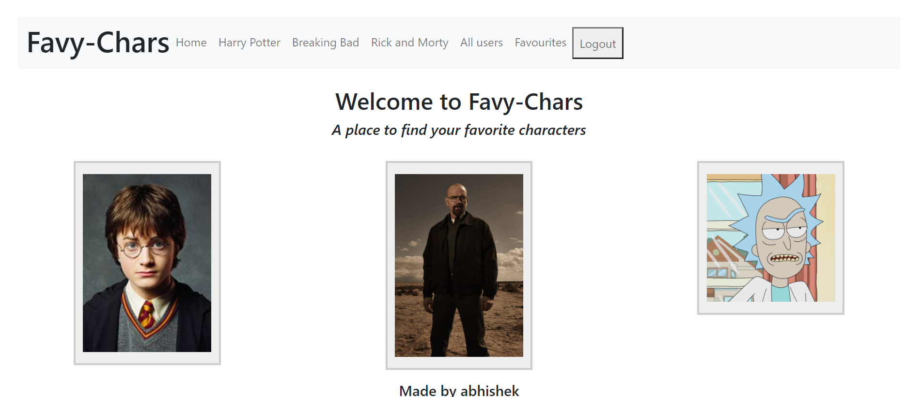
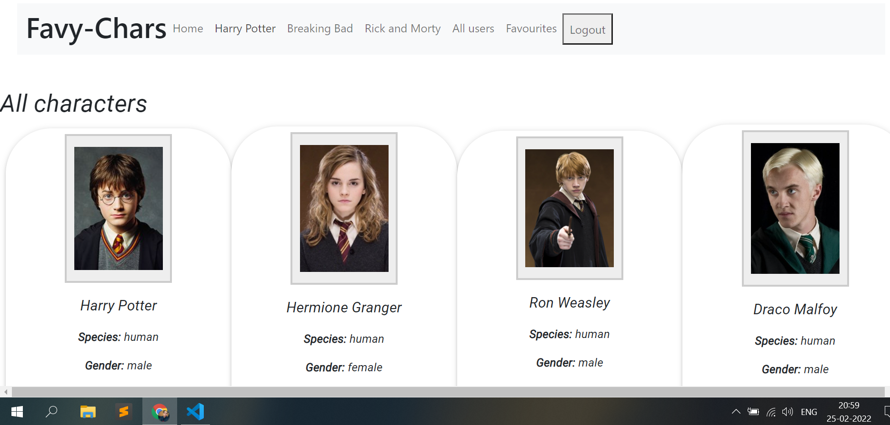
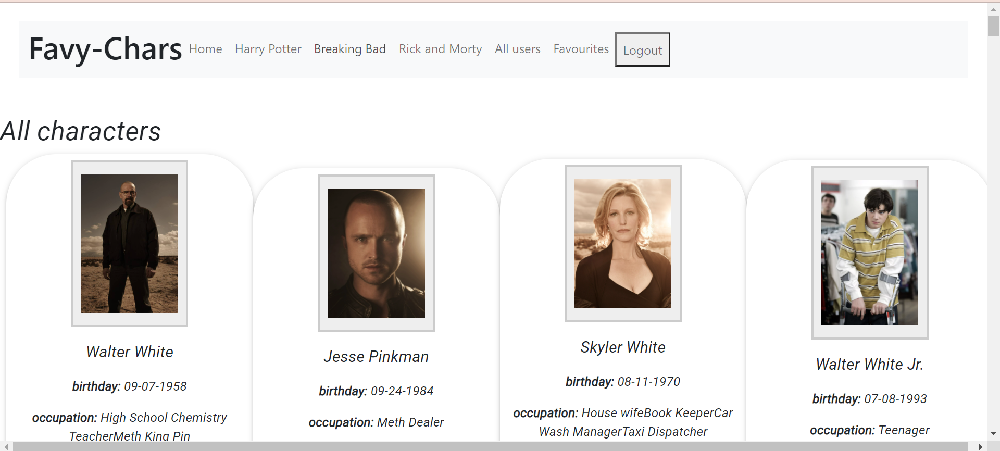
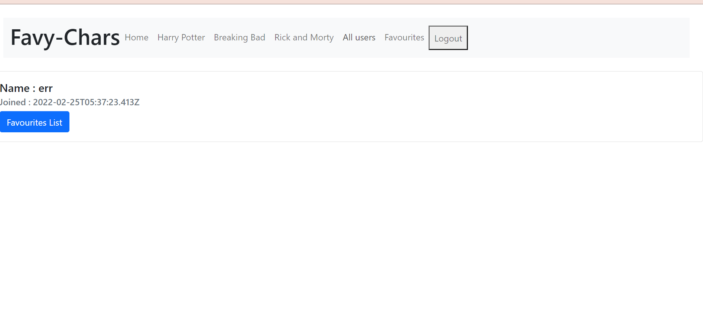
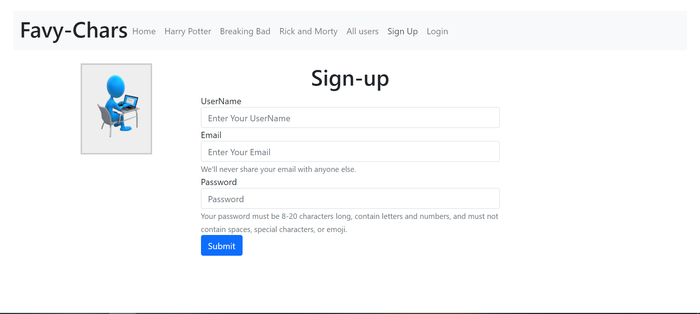
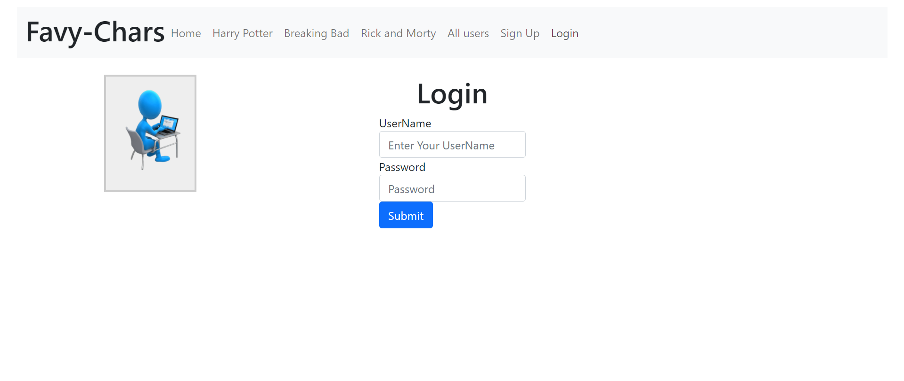
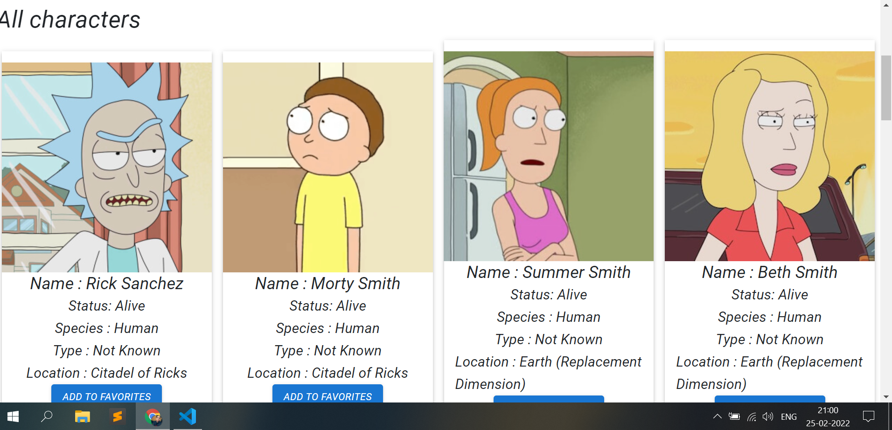

# Favy-Char
<i> A Mern app where users can save their Favourites characters from Harrypotter,BreakingBad and RickMorty( ͡❛ ͜ʖ ͡❛)👌 </i>

<ul>
  <h4> Things Used in this Projects 🐤 :- </h4>
  <li> 1.MERN Stack </li>
  <li> 2.Material-UI </li>
  <li> 3.Bootstrap </li>
</ul>

<ul>
  <h4> APIS Used in this Projects 📊 :- </h4>
  <li> 1.HarryPotter api <a href="http://hp-api.herokuapp.com/api/characters"><i>HarryPotterapi</i></a>  </li>
  <li> 2.Rick and Morty api <a href="https://rickandmortyapi.com/documentation/#get-all-characters"><i>Rickandmortyapi</i></a> </li>
  <li> 3.Breaking bad api <a href="https://rickandmortyapi.com/documentation/#get-all-characters"><i>Breakingbadapi</i></a></li>
</ul>

<ul>
 <ul>
  <h4> Functions of this App 🤯 :- </h4>
  <li> 1.User can sign-up or sign-in  </li>
  <li> 2.User can see all characters from Harrypotter,breakingbad,and rickandmorty </li>
  <li> 3.Users can Save Their favourites characters from the list</li>
   <li> 4.Users Can see Total users with names</li>
</ul>
   
  ScreenShots of the App 🧟‍♀️:-
  

    </img>
    </img>
    </img>
    </img>
    </img>
    </img>
    </img>
  

  
  <h1>
  🤷‍♂️   Thanks...
  </h1>
